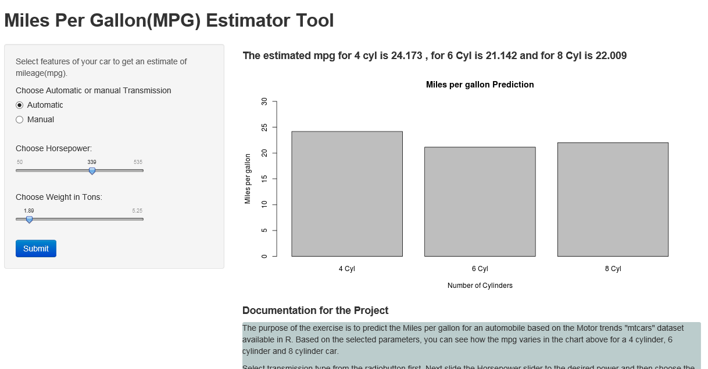

Developing Data Products Presentation
========================================================
author: Chethan 
date: 12/21/2014

## Project to Demonstrate Shiny App in R

Goal of the project
========================================================
transition: rotate
transition-speed: slow
incremental: true

## This project

* Demonstrates the use of Shiny library
  + Uses the 'mtcars' dataset available in R 
  + Creates a linear regression model with mpg (miles per gallon) as the output variable
  + Creates UI to accept user input such as transmission type, weight and 
  + Performs reactive server calculation only when the input changes
  + Outputs a plot of predicted miles per gallon for 4, 6 and 8 Cylinders


Linear Rgression Model to Predict Miles per Gallon
========================================================
transition: fade

```r
fit<-lm(mpg~factor(am)+wt+factor(cyl)+hp-1,data=mtcars)
fit
```

```

Call:
lm(formula = mpg ~ factor(am) + wt + factor(cyl) + hp - 1, data = mtcars)

Coefficients:
 factor(am)0   factor(am)1            wt  factor(cyl)6  factor(cyl)8  
     33.7083       35.5175       -2.4968       -3.0313       -2.1637  
          hp  
     -0.0321  
```

Sample Web Page 
========================================================
transition: linear




Predicted MPG Output
========================================================
transition: rotate
transition-speed: slow


## The reactive function 

* Uses the predict function to calculate mpg based on the inputs
* It only works then one or more of the inputs change

### Significance of the Model

* The dataset is small but provides some effective insight
* It shows how weight and horse power negatively affect mpg
* This has forced auto makers to reduce weight of vehicles to improve mpg


